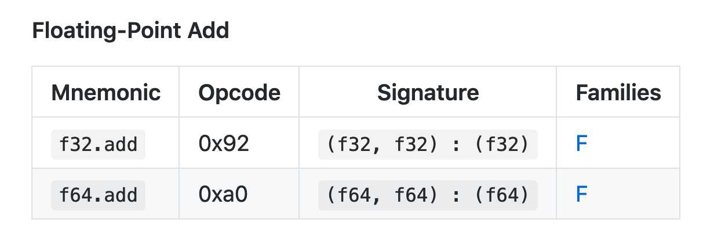
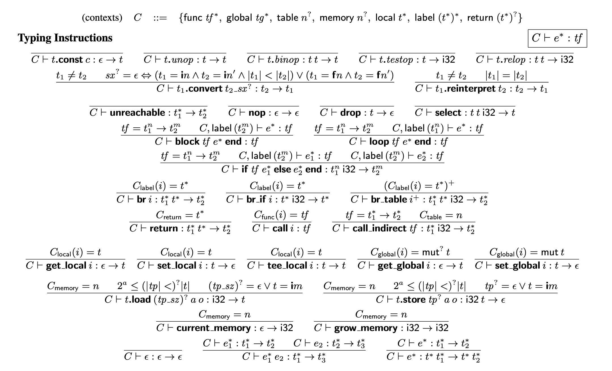
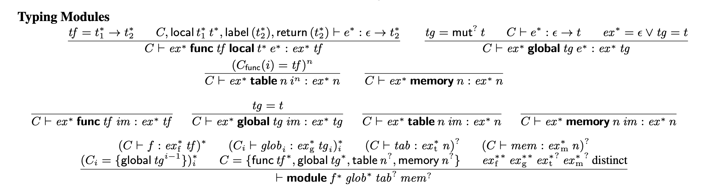

## My WebAssembly knowledge in 2018


::: {.columns style="display: flex;"}
::: column

- Fast (successor to asm.js)

- Many use cases
    - Games
    - Graphics
    - Large Fibonacci numbers

- Formally specified, verified

- Might put me out of a job
:::

::: {.column style="display: flex; align-items: center; justify-content: center;"}

{width=400px}


:::
:::


## Some context

I'm an academic first, software engineer second

## By day 🌝

- Building [Notion](http://notion.so), a practical computing toolkit
- Previously building [Khan Academy](http://khanacademy.org)
- Extremely professional JavaScript developer

## By night 🌚

- Researching programming languages as user interfaces
- Functional programming, rich type systems
- Skipped operating systems class to study type theory

## Two kinds of WebAssembly talks


::: notes
There are at least two kinds of WebAssembly talks.

The first variant is a broad and shallow overview of the technology. In 30 minutes, you can learn:

- What WebAssembly is, and what it's good for
- How to build a simple program that computes a very large number
- How to gently correct people who claim it will "replace JavaScript"
- System still mostly a black box
:::


## Two kinds of WebAssembly talks


::: notes
This is not that talk.

Instead of doing a broad and practical overview of Wasm, this talk goes narrow and deep.

- Start with a seemingly straightforward and contrived premise
- Go deep into WebAssembly internals to accomplish said premise
- Do lots of gross and unsafe programming

Along the way, we'll explore:

- The JavaScript API for interacting with Wasm modules
- Wasm module layout
- Stack machine and instruction semantics
:::


## Why visit the abyss?

---

Have you encountered a **nifty-sounding technology** and thought to yourself:

> This seems nifty!

. . .

> Too bad I am a **JavaScript developer** and **don't actually understand this lol** ¯\\\_(ツ)\_\/¯


## "I'm just a frontend developer..."

- **Algebraic data types?** I don't do algebra, data, *or* types
- **Spectre/Meltdown?** *I'm* having a Meltdown
- **Containers?** Does following [\@jessfraz](http://twitter.com/JESSFRAZ) on Twitter count

## I was like this once

Those are all actual quotes from me


## Ok so WebAssembly

> WebAssembly (abbreviated Wasm) is a **binary instruction format** for a **stack-based virtual machine**.

. . .

> Wasm is designed as a portable **target for compilation of high-level languages** like C/C++/Rust.


## Why does WebAssembly matter?

- Need a **performant runtime** for the Web
- But as we all know, JavaScript was designed by accident in 10 minutes and originally intended to make WordArt
- Prior art: ActiveX, NaCl, asm.js


## Design goals


::: columns
::: column

### Execution semantics

- Safe to execute
- Fast
- Portable
- Deterministic
- Easy to reason about

:::

::: column

### Representation

- Compact and fast to decode
- Easy to validate, compile (single-pass)

:::
:::

[@Haas:2017:BWU:3062341.3062363]

---

> To our knowledge, WebAssembly is the **first industrial-strength language** or VM that has been **designed with a formal semantics from the start**. This not only demonstrates the **“real world” feasibility** of such an approach, but also that it leads to a notably clean design… **nothing in its design depends on the Web** or a JavaScript environment. [@Haas:2017:BWU:3062341.3062363]

## Design choices

- **Types:** `i32`, `i64`, `f32`, `f64`, functions

- **Linear memory:** each module has its own sandboxed memory space separate from code space and execution stack

- **Structured control flow:** `block` and `loop` instead of arbitrary jumps

## Compilation target

For "high-level" languages like C, C++, Rust

## Compiling functions


:::::: columns
::: {.column width=30%}

C++

```{.cpp .med}
int addOne(int x) {
    return x + 1;
}
```

:::

::: {.column width=70%}

WebAssembly

```{.js .med}
(func $func0 (param $var0 i32) (result i32)
  get_local $var0
  i32.const 1
  i32.add
)
```

:::
::::::


## Compiling modules


:::::: columns
::: {.column width=35%}

```{.cpp .small}
int addOne(int x) {
    return x + 1;
}

int main(int argc) {
    return addOne(argc);
}
```
:::

::: {.column width=65%}

<span style="opacity: 0;">WebAssembly</span>

```{.js style="opacity: 0;"}
(module
  (type $type0 (func (param i32) (result i32)))
  (table 0 anyfunc)
  (memory 1)
  (export "memory" memory)
  (export "_Z6addOnei" $func0)
  (export "main" $func1)
  (func $func0 (param $var0 i32) (result i32)
    get_local $var0
    i32.const 1
    i32.add
  )
  (func $func1 (param $var0 i32) (result i32)
    get_local $var0
    call $func0
  )
)
```

:::

::::::


## Compiling modules


:::::: columns
::: {.column width=35%}

```{.cpp .small}
int addOne(int x) {
    return x + 1;
}

int main(int argc) {
    return addOne(argc);
}
```
:::

::: {.column width=65%}

```{.js .small}
(module
  (type $type0 (func (param i32) (result i32)))
  (table 0 anyfunc)
  (memory 1)
  (export "memory" memory)
  (export "_Z6addOnei" $func0)
  (export "main" $func1)
  (func $func0 (param $var0 i32) (result i32)
    get_local $var0
    i32.const 1
    i32.add
  )
  (func $func1 (param $var0 i32) (result i32)
    get_local $var0
    call $func0
  )
)
```

:::
::::::


## Stack-based virtual machine

- An execution paradigm for the language
- Enables **more compact programs** compared to a register-based model


## Stack machine semantics


```js
(func $func0 (param $var0 i32) (result i32)
  get_local $var0
  i32.const 1
  i32.add
)
(func $func1 (param $var0 i32) (result i32)
  get_local $var0
  call $func0
)
```

<style type="text/css">
div.wasm-stack {
    border-bottom: 5px solid #555;
    display: flex;
    flex-direction: column;
    justify-content: flex-end;
    align-items: center;
    padding: 10px 0;
}

div.wasm-stack > pre,
div.wasm-stack > div {
    width: 90%;
    margin: 10px auto;
}

div.wasm-stack div.wasm-stack {
    border: 3px solid #888;
    position: relative;
    min-height: 1em;
}

div.wasm-stack div.wasm-stack::before {
    content: "1";
    position: absolute;
    top: 0;
    right: -20px;
    transform: translateX(100%);
    font-size: 0.9em;
}

div.wasm-stack div.wasm-stack.invalid {
    border-color: red;
}

div.wasm-stack div.wasm-stack.invalid::before {
    color: red;
}

div.wasm-stack div.wasm-stack::after {
    content: "$var0";
    position: absolute;
    bottom: 0;
    right: -20px;
    transform: translateX(100%);
    display: block;
    background: var(--pink);
    padding: 10px 20px;
    font-family: var(--monospace-stack);
    font-size: 0.7em;
}

div.wasm-stack .current {
    background: var(--green);
}

.hidden {
    opacity: 0;
}
</style>


## Referencing local variables


:::::: {.columns style="display: flex;"}
::: {.column style="position: relative;"}

1. **`get_local $var0`{.js}**

2. `call $func0`{.js}

:::

::: {.column .wasm-stack style="width: 40%;"}

```current
$var0
```

:::
::::::

---

## Calling functions


:::::: {.columns style="display: flex;"}
::: {.column style="position: relative;"}

1. `get_local $var0`{.js}

2. **`call $func0`{.js}**

:::

::: {.column .wasm-stack style="width: 40%;"}

```current
$var0
```

:::
::::::


## Function signatures

```js
(func $func0 (param $var0 i32) (result i32)
  ; ...
)
```


## Pop arguments off the stack

<!-- TODO: Highlight "param $var0 i32" -->


```js
(func $func0 (param $var0 i32) (result i32) ...)
```

:::::: {.columns style="display: flex;"}
::: {.column style="position: relative;"}

1. `get_local $var0`{.js}

2. **`call $func0`{.js}**

:::

::: {.column .wasm-stack style="width: 40%;"}

```{.current .hidden}
$var0
```

:::
::::::


## Create a new stack frame

<!-- TODO: Highlight "param $var0 i32" -->


```js
(func $func0 (param $var0 i32) (result i32) ...)
```

:::::: {.columns style="display: flex;"}
::: {.column style="position: relative;"}

1. `get_local $var0`{.js}

2. **`call $func0`{.js}**

:::

::: {.column .wasm-stack style="width: 40%;"}

::: wasm-stack

```hidden
$var0
```

:::

:::
::::::

---


## Inside a function: get local variable


:::::: {.columns style="display: flex;"}
::: {.column style="position: relative;"}

1. `get_local $var0`{.js}

2. `call $func0`{.js}

    1. **`get_local $var0`{.js}**

    2. `i32.const 1`{.js}

    3. `i32.add`{.js}

:::

::: {.column .wasm-stack style="width: 40%;"}

::: wasm-stack

```current
$var0
```

:::

:::
::::::


## Constants


:::::: {.columns style="display: flex;"}
::: {.column style="position: relative;"}

1. `get_local $var0`{.js}

2. `call $func0`{.js}

    1. `get_local $var0`{.js}

    2. **`i32.const 1`{.js}**

    3. `i32.add`{.js}

:::

::: {.column .wasm-stack style="width: 40%;"}

::: wasm-stack

```current
1
```

```
$var0
```

:::

:::
::::::


## Addition


:::::: {.columns style="display: flex;"}
::: {.column style="position: relative;"}

1. `get_local $var0`{.js}

2. `call $func0`{.js}

    1. `get_local $var0`{.js}

    2. `i32.const 1`{.js}

    3. **`i32.add`{.js}**

:::

::: {.column .wasm-stack style="width: 40%;"}

::: wasm-stack

```
1
```

```
$var0
```

:::

:::
::::::


## Instruction signatures



[WebAssembly Reference Manual](https://github.com/sunfishcode/wasm-reference-manual/blob/master/WebAssembly.md#instruction-descriptions)


## Addition: pop inputs


:::::: {.columns style="display: flex;"}
::: {.column style="position: relative;"}

1. `get_local $var0`{.js}

2. `call $func0`{.js}

    1. `get_local $var0`{.js}

    2. `i32.const 1`{.js}

    3. **`i32.add`{.js}**

:::

::: {.column .wasm-stack style="width: 40%;"}

::: wasm-stack

:::

:::
::::::


## Addition: push outputs


:::::: {.columns style="display: flex;"}
::: {.column style="position: relative;"}

1. `get_local $var0`{.js}

2. `call $func0`{.js}

    1. `get_local $var0`{.js}

    2. `i32.const 1`{.js}

    3. **`i32.add`{.js}**

:::

::: {.column .wasm-stack style="width: 40%;"}

::: wasm-stack

```current
$var0 + 1
```

:::

:::
::::::


## Returning to caller


:::::: {.columns style="display: flex;"}
::: {.column style="position: relative;"}

1. `get_local $var0`{.js}

2. `call $func0`{.js}

    1. `get_local $var0`{.js}

    2. `i32.const 1`{.js}

    3. `i32.add`{.js}

:::

::: {.column .wasm-stack style="width: 40%;"}


```current
$var0 + 1
```

:::
::::::


<!--
## Remark (less important)

Stack machine equivalent to **postorder traversal** of abstract syntax tree!

. . .

:::::: columns
::: {.column width=40%}

```js
(i32.add
 (get_local $0)
 (i32.const 1)
)
```

:::

::: {.column width=40%}

```js
get_local $var0
i32.const 1
i32.add
```

:::
::::::
-->


## Slim pls

*"There has been no JavaScript in this talk so far"*


## JavaScript API

Loading a `.wasm` file in three lines of JavaScript

```js
fetch('demo/calls.wasm')
  .then(response => response.arrayBuffer())
  .then(WebAssembly.instantiate)
  .then(({module, instance}) => {
      // ... do stuff
  })
```

<script type="text/javascript">
fetch('demo/calls.wasm')
    .then(response => response.arrayBuffer())
    .then(bytes => WebAssembly.instantiate(bytes))
    .then(({module, instance}) => {
        window.demo = { module, instance }
    })
</script>


## Inspecting exports

```js
WebAssembly.Module.exports(module)
```

```js
[ { "name": "memory", "kind": "memory" }
, { "name": "_Z11getCallsPtrv", "kind": "function" }
, { "name": "_Z6addOnei", "kind": "function" }
, { "name": "main", "kind": "function" }
]
```


## Calling functions


::: {.columns style="display: flex;"}

::: {.column style="width: 50%; display: flex; flex-direction: column; align-items: flex-start;"}

```js
instance.exports
```

```{.js .med}
{ Z11getCallsPtrv: function 0()
, _Z6addOnei: function 1()
, main: function 2()
, memory: WebAssembly.Memory
}
```

:::

::: {.column style="width: 50%; display: flex; flex-direction: column; align-items: flex-start;"}


```{.js .med}
instance.exports._Z6addOnei(2019)
```

```js
2020
```

:::
:::


## `wasm-trace`

Don't play with matches, play with binaries!


## Background


::: columns
::: {.column width=40%}

{width=500px}


:::

::: {.column style="padding-left: 20px;"}

- This is my roommate Meg
- We like static analysis, systems programming, Rust, compilers
- Needed a cool Rust project

:::

:::


## Nick's idea

> a tool that would take a wasm module and **modify its code to inject tracing calls**, so that you could get an trace of the wasm's execution in the console


::: {.columns style="display: flex;"}
::: column
{width=200px}

[Nick Fitzgerald](http://fitzgeraldnick.com/), Mozilla


:::
::: column

{width=200px}

[Jim Blandy](https://www.red-bean.com/~jimb/), Mozilla


:::
:::

## Start with a Rust program


::: columns
::: column

Rust

```{.rust .med}
fn addOne(x: i32) -> i32 {
  x + 1
}
fn main(x: i32) -> i32 {
  addOne(x) + addOne(x)
}
```

:::
::: column

JavaScript

```{.js .med}
function addOne(x) {
  return x + 1
}
function main(x) {
  return addOne(x) + addOne(x)
}
```


:::
:::


## Allocate global memory

```rust
static ref TRACER = Mutex::new(Tracer::new());

fn expose_tracer() -> *const i32 {
    TRACER.lock().unwrap().as_ptr()
}
```

. . .


```js
const TRACER = []

function exposeTracer() {
    return TRACER  // exposes a memory address
}
```


\*little bit of hand-waving here


## Compile Rust program to `.wasm` module


Then transform each function in `module.wasm`!


## Module layout


:::::: columns
::: {.column width=65%}

```{.js .small}
(module
  (type $type0 (func (param i32) (result i32)))
  (table 0 anyfunc)
  (memory 1)
  (export "memory" memory)
  (export "_Z6addOnei" $func0)
  (export "main" $func1)
  (func $func0 (param $var0 i32) (result i32)
    get_local $var0
    i32.const 1
    i32.add
  )
  (func $func1 (param $var0 i32) (result i32)
    get_local $var0
    call $func0
  )
)
```

:::
::: {.column style="width: 25%; position: relative;"}

- **Type**
- Import
- Function
- **Table**
- **Memory**
- Global
- **Export**
- Start
- Element
- **Code**

:::
::::::


## Add prologue instructions


```diff
  (func $func0 (param $var0 i32) (result i32)
+   i32.const 0  ; func0
+   call $logFunctionCall
    get_local $var0
    i32.const 1
    i32.add
  )
```


## How to write return value to memory?


::: columns
::: column


```js
get_local $var0
i32.const 1
i32.add
```

:::
::: {.column width=40%}
::: wasm-stack

::: wasm-stack

```current
$var0 + 1
```
:::

:::
:::
:::


## Calling `logFunctionReturn` pops an argument off the stack!


::: columns
::: column


```diff
  get_local $var0
  i32.const 1
  i32.add
+ call $logFunctionReturn
```

:::
::: {.column style="width: 35%; padding-left: 20px;"}
::: wasm-stack

::: wasm-stack
:::

::: {.wasm-stack .invalid}

```{.current .hidden}
$var0 + 1
```
:::

:::
:::
:::

. . .

**THIS IS AN INVALID STATE!!!!!!**

`$func0` must return a value, but the stack is now empty!


## `tee_local`

"Copies the top of the stack" to a local variable

::: columns
::: column

```diff
  get_local $var0
  i32.const 1
  i32.add
+ tee_local $return_value
```

:::
::: column

```js
// stack = [var0 + 1]
const temp = stack.pop()
// stack = []
returnValue = temp
stack.push(temp)
// stack = [var0 + 1]
```

:::
:::


## Now we can `get_local`...


::: columns
::: column


```diff
   get_local $var0
   i32.const 1
   i32.add
+  tee_local $return_value
+  get_local $return_value
```

:::
::: {.column style="width: 40%; padding-left: 20px;"}
::: wasm-stack

::: wasm-stack

```current
$var0 + 1
```

```
$var0 + 1
```
:::

:::
:::
:::


## ...and `call $logFunctionReturn`


::: columns
::: column


```diff
   get_local $var0
   i32.const 1
   i32.add
+  tee_local $return_value
+  get_local $return_value
+  call $logFunctionReturn
```

:::
::: {.column style="width: 40%; padding-left: 20px;"}
::: wasm-stack

::: wasm-stack
:::

::: wasm-stack

```
$var0 + 1
```
:::

:::
:::
:::

## Final epilogue instructions


```diff
  (func $func0 (param $var0 i32) (result i32)
    i32.const 0  ; func0
    call $logFunctionCall
    get_local $var0
    i32.const 1
    i32.add
+   tee_local $return_value
+   get_local $return_value
+   call $logFunctionReturn
  )
```


## Now, the magic

```js
fetch('demo/output.wasm')
  .then(response => response.arrayBuffer())
  .then(WebAssembly.instantiate)
  .then(({module, instance}) => {
    window.module = module
    window.instance = instance
  })
```

## Run a function...

```js
instance.exports.negate(10) // -10
```

## And look at the memory!

```js
const buf = new Int32Array(
  instance.exports.memory.buffer,
  instance.exports.__expose_tracer(),
  instance.exports.__expose_tracer_len(),
)
```

## Soundness

- **Type safety:** no invalid calls, no illegal accesses to locals
- **Memory safety:** no buffer overflows, no dangling pointers; code and call stack are not accessible to the program


---

> Soundness proves that the reduction rules...actually cover all execution states that can arise for valid programs. In other words, it proves the absence of undefined behavior in the execution semantics.


## Typing rules for instructions

{width=80%}


## Typing rules for modules




## This is actually impressive


::: columns
::: column


:::
::: column

- Looks scary!

- But compare to JVM bytecode verification: 150 pages of the current spec!

:::
:::

## A formal semantics from the start

> Validation ensures that the module is well-defined and that <mark>**its code cannot exhibit any undefined behavior**</mark>. In particular, along with some runtime checks, this ensures that <mark>**no program can access or corrupt memory it does not own**</mark>.


## Further reading


::: columns
::: column

- [WebAssembly reference manual](https://github.com/sunfishcode/wasm-reference-manual/blob/master/WebAssembly.md#s-signed-integer-instruction-family)
- [WebAssembly Explorer](https://mbebenita.github.io/WasmExplorer/)

:::
::: column

- [Modules](https://github.com/WebAssembly/design/blob/master/Modules.md#integration-with-es6-modules)
- [Semantics](https://github.com/WebAssembly/design/blob/master/Semantics.md)
- [Binary encoding](https://github.com/WebAssembly/design/blob/master/BinaryEncoding.md)

:::
:::


## With thanks

- [Meg Grasse](http://meggyg.me/), Apple
- [Jesse Tov](http://users.cs.northwestern.edu/~jesse/), Northwestern University
- [Nick Fitzgerald](http://fitzgeraldnick.com/), Mozilla
- [Jim Blandy](https://www.red-bean.com/~jimb/), Mozilla

## Talk to me on the internet

<style type="text/css">
.reveal section .small-logo {
    width: 1.2em;
    transform: translateY(15%);
    margin-right: 0.15em;
}
</style>

- [\@soylentqueen](http://twitter.com/soylentqueen)

- GitHub: [sarahlim/wasm-trace](http://github.com/sarahlim/wasm-trace)

- {.small-logo} Notion is hiring! [notion.so/jobs](http://notion.so/jobs)


::: notes

- **Soundness:** you can only prove true things
    - Easy; just ensure your axioms are true and all inference rules preserve truth.
- **Completeness:** you can prove _all_ true things
    - Hard; you need strong enough axioms to model semantic truth. It's not obvious that this is even possible.

different formalizations for different purposes, e.g.,

- operational/computational semantics for execution
- axiomatic/declarative semantics for deductive reasoning

JS is nondeterministic:

- `for...in` iterates through enumerable properties in unspecified order
    - Defining a collection as an inductive relation captures non-determinism, but cannot be executed
    - Defining semantics as an eval function can be executed but not capture non-determinism

@Park:2015:KCF:2813885.2737991
:::
